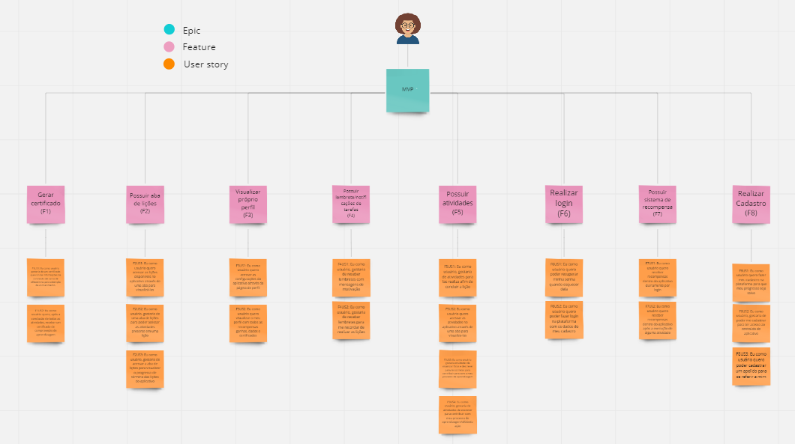
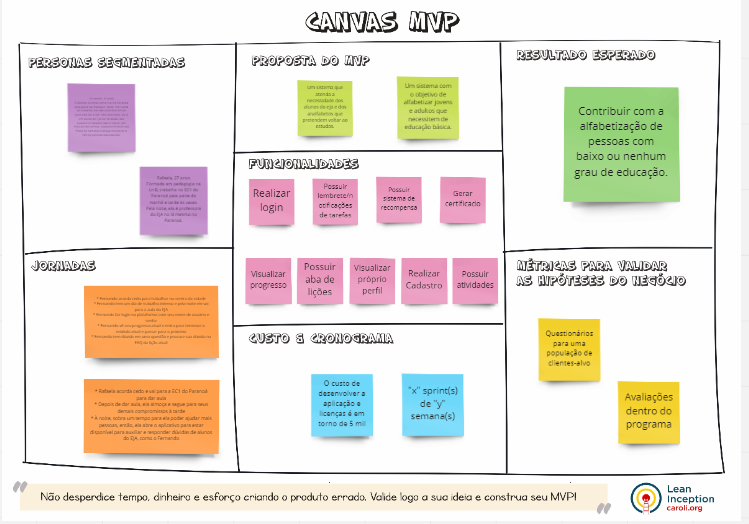
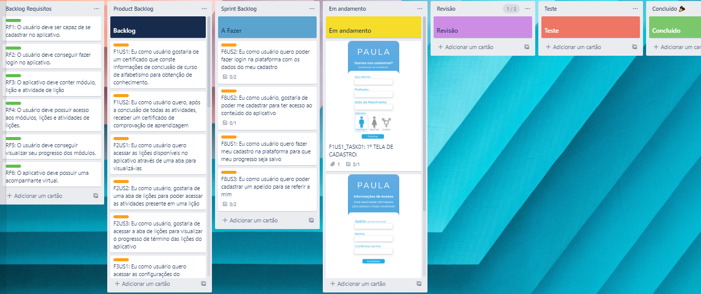

# UNIDADE 2

## Requisitos 

### Vídeo de apresentação da Unidade 2

<iframe width="560" height="315" src="https://www.youtube.com/embed/_CSYlLFAuyw" title="YouTube video player" frameborder="0" allow="accelerometer; autoplay; clipboard-write; encrypted-media; gyroscope; picture-in-picture" allowfullscreen></iframe>

### Lista de requisitos

#### Funcionais
- RF1: O usuário deve poder fazer seu cadastro na plataforma
- RF2: O usuário deve poder fazer login na plataforma com os dados fornecidos na fase de cadastro
- RF3: O usuário deve poder realizar as lições e as atividades dentro de cada lição
- RF4: O usuário deve poder ver o progresso alcançado no completar das lições
- RF5: O usuário deve poder ver as informações de seu perfil (seu cadastro)
- RF6: O usuário deve poder ser recompensado por ações feitas dentro do aplicativo
- RF7: O usuário deve poder receber/visualizar um certificado por lições concluídas
- RF8: O usuário deve poder receber notificações em seu celular sobre o aplicativo

#### Não Funcionais
- RNF1: O frontend do aplicativo deve ser desenvolvido em Flutter e o Backend em Python Django
- RNF2: O aplicativo deverá ser desenvolvido utilizando as metodologias ágeis Scrum com XP em sprints de 1 semana
- RNF3: O aplicativo deverá ser desenvolvido para Android de versão 8.0>
- RNF4: O aplicativo precisa ser limitado à no máximo 100Mb de tamanho
- RNF5: O aplicativo deve conter uma forma de redirecionamento para um canal de ajuda.

### Kanbam Framework SAFe

### Canvas MVP

### Kanbam Trello

## Método de Desenvolvimento de Software

### Título: Como o git vai salvar a sua vida
### Tema: Fundamentos do GIT

### Integrantes que conduziram a ativdade:

- Caio Berg Carlos Leite | 200015753 |
- Emerson Luis Teles Dos Santos | 200017322 |
- Lucas de Padua Bergamaschi | 200049429 |
- Mateus De Almeida Dias | 190142260 |
- Pedro Lucas Figueiredo Santana | 202017049 |

## Conteúdo:

    Introdução:

    O Git é um projeto de código aberto maduro e com manutenção ativa desenvolvido em 2005 por Linus Torvalds, o famoso criador do kernel do sistema operacional Linux. Um número impressionante de projetos de software depende do Git para controle de versão, incluindo projetos comerciais e de código-fonte aberto.

    Por que o GIt é o melhor para o desempenho?

    As características brutas de desempenho do Git são muito fortes quando comparadas a muitas alternativas. Fazer o commit de novas alterações, branches, mesclagem e comparação de versões anteriores – tudo é otimizado para desempenho. Os algoritmos implementados no Git aproveitam o conhecimento profundo sobre atributos comuns de árvores de arquivos de código-fonte reais, como costumam ser modificados ao longo do tempo e quais são os padrões de acesso.

    O Git é seguro?

    O Git foi projetado com a integridade do código-fonte gerenciado como uma prioridade. O conteúdo dos arquivos, bem como os verdadeiros relacionamentos entre arquivos e diretórios, versões, tags e commits, todos esses objetos no repositório do Git são protegidos com um algoritmo de hash de criptografia seguro chamado SHA1. Isso protege o código e o histórico de alterações contra alterações acidentais e maliciosas e garante que o histórico tenha rastreabilidade total.

    Git & Github - Qual a diferença entre eles?

    O Github é o serviço de Web compartilhado para projetos que utilizam o Git para versionamento, ou seja, o GitHub é apenas um local na nuvem que irá armazenar os projetos versionados pelo Git

# GIT

## Estados

- Modificado (modified);
- Preparado (staged/index)
- Consolidado (comitted);

## Ajuda

##### Geral

    git help

##### Comando específico

    git help add
    git help commit
    git help <qualquer_comando_git>

## Configuração

### Geral

As configurações do GIT são armazenadas no arquivo **.gitconfig** localizado dentro do diretório do usuário do Sistema Operacional (Ex.: Windows: C:\Users\Documents and Settings\Leonardo ou \*nix /home/leonardo).

As configurações realizadas através dos comandos abaixo serão incluídas no arquivo citado acima.

##### Setar usuário

    git config --global user.name "Leonardo Comelli"

##### Setar email

    git config --global user.email leonardo@software-ltda.com.br

##### Setar editor

    git config --global core.editor vim

##### Setar ferramenta de merge

    git config --global merge.tool vimdiff

##### Setar arquivos a serem ignorados

    git config --global core.excludesfile ~/.gitignore

##### Listar configurações

    git config --list

### Ignorar Arquivos

Os nomes de arquivos/diretórios ou extensões de arquivos listados no arquivo **.gitignore** não serão adicionados em um repositório. Existem dois arquivos .gitignore, são eles:

- Geral: Normalmente armazenado no diretório do usuário do Sistema Operacional. O arquivo que possui a lista dos arquivos/diretórios a serem ignorados por **todos os repositórios** deverá ser declarado conforme citado acima. O arquivo não precisa ter o nome de **.gitignore**.

- Por repositório: Deve ser armazenado no diretório do repositório e deve conter a lista dos arquivos/diretórios que devem ser ignorados apenas para o repositório específico.

## Repositório Local

### Criar novo repositório

    git init

### Verificar estado dos arquivos/diretórios

    git status

### Adicionar arquivo/diretório (staged area)

##### Adicionar um arquivo em específico

    git add meu_arquivo.txt

##### Adicionar um diretório em específico

    git add meu_diretorio

##### Adicionar todos os arquivos/diretórios

    git add .

##### Adicionar um arquivo que esta listado no .gitignore (geral ou do repositório)

    git add -f arquivo_no_gitignore.txt

### Comitar arquivo/diretório

##### Comitar um arquivo

    git commit meu_arquivo.txt

##### Comitar vários arquivos

    git commit meu_arquivo.txt meu_outro_arquivo.txt

##### Comitar informando mensagem

    git commit meuarquivo.txt -m "minha mensagem de commit"

### Remover arquivo/diretório

##### Remover arquivo

    git rm meu_arquivo.txt

##### Remover diretório

    git rm -r diretorio

### Visualizar histórico

##### Exibir histórico

    git log

##### Exibir histórico com diff das duas últimas alterações

    git log -p -2

##### Exibir resumo do histórico (hash completa, autor, data, comentário e qtde de alterações (+/-))

    git log --stat

##### Exibir informações resumidas em uma linha (hash completa e comentário)

    git log --pretty=oneline

##### Exibir histórico com formatação específica (hash abreviada, autor, data e comentário)

    git log --pretty=format:"%h - %an, %ar : %s"

- %h: Abreviação do hash;
- %an: Nome do autor;
- %ar: Data;
- %s: Comentário.

Verifique as demais opções de formatação no [Git Book](http://git-scm.com/book/en/Git-Basics-Viewing-the-Commit-History)

##### Exibir histório de um arquivo específico

    git log -- <caminho_do_arquivo>

##### Exibir histórico de um arquivo específico que contêm uma determinada palavra

    git log --summary -S<palavra> [<caminho_do_arquivo>]

##### Exibir histórico modificação de um arquivo

    git log --diff-filter=M -- <caminho_do_arquivo>

- O <D> pode ser substituido por: Adicionado (A), Copiado (C), Apagado (D), Modificado (M), Renomeado (R), entre outros.

##### Exibir histório de um determinado autor

    git log --author=usuario

##### Exibir revisão e autor da última modificação de uma bloco de linhas

    git blame -L 12,22 meu_arquivo.txt

### Desfazendo operações

##### Desfazendo alteração local (working directory)

Este comando deve ser utilizando enquanto o arquivo não foi adicionado na **staged area**.

    git checkout -- meu_arquivo.txt

##### Desfazendo alteração local (staging area)

Este comando deve ser utilizando quando o arquivo já foi adicionado na **staged area**.

    git reset HEAD meu_arquivo.txt

Se o resultado abaixo for exibido, o comando reset _não_ alterou o diretório de trabalho.

    Unstaged changes after reset:
    M	meu_arquivo.txt

A alteração do diretório pode ser realizada através do comando abaixo:
git checkout meu_arquivo.txt

## Repositório Remoto

### Exibir os repositórios remotos

    git remote

    git remote -v

### Vincular repositório local com um repositório remoto

    git remote add origin git@github.com:leocomelli/curso-git.git

### Exibir informações dos repositórios remotos

    git remote show origin

### Renomear um repositório remoto

    git remote rename origin curso-git

### Desvincular um repositório remoto

    git remote rm curso-git

### Enviar arquivos/diretórios para o repositório remoto

O primeiro **push** de um repositório deve conter o nome do repositório remoto e o branch.

    git push -u origin master

Os demais **pushes** não precisam dessa informação

    git push

### Atualizar repositório local de acordo com o repositório remoto

##### Atualizar os arquivos no branch atual

    git pull

##### Buscar as alterações, mas não aplica-las no branch atual

    git fetch

### Clonar um repositório remoto já existente

    git clone git@github.com:leocomelli/curso-git.git

### Tags

##### Criando uma tag leve

    git tag vs-1.1

##### Criando uma tag anotada

    git tag -a vs-1.1 -m "Minha versão 1.1"

##### Criando uma tag assinada

Para criar uma tag assinada é necessário uma chave privada (GNU Privacy Guard - GPG).

    git tag -s vs-1.1 -m "Minha tag assinada 1.1"

##### Criando tag a partir de um commit (hash)

    git tag -a vs-1.2 9fceb02

##### Criando tags no repositório remoto

    git push origin vs-1.2

##### Criando todas as tags locais no repositório remoto

    git push origin --tags

### Branches

O **master** é o branch principal do GIT.

O **HEAD** é um ponteiro _especial_ que indica qual é o branch atual. Por padrão, o **HEAD** aponta para o branch principal, o **master**.

##### Criando um novo branch

    git branch bug-123

##### Trocando para um branch existente

    git checkout bug-123

Neste caso, o ponteiro principal **HEAD** esta apontando para o branch chamado bug-123.

##### Criar um novo branch e trocar

    git checkout -b bug-456

##### Voltar para o branch principal (master)

    git checkout master

##### Resolver merge entre os branches

    git merge bug-123

Para realizar o _merge_, é necessário estar no branch que deverá receber as alterações. O _merge_ pode automático ou manual. O merge automático será feito em arquivos textos que não sofreram alterações nas mesmas linhas, já o merge manual será feito em arquivos textos que sofreram alterações nas mesmas linhas.

A mensagem indicando um _merge_ manual será:

    Automerging meu_arquivo.txt
    CONFLICT (content): Merge conflict in meu_arquivo.txt
    Automatic merge failed; fix conflicts and then commit the result.

##### Apagando um branch

    git branch -d bug-123

##### Listar branches

###### Listar branches

    git branch

###### Listar branches com informações dos últimos commits

    git branch -v

###### Listar branches que já foram fundidos (merged) com o **master**

    git branch --merged

###### Listar branches que não foram fundidos (merged) com o **master**

    git branch --no-merged

##### Criando branches no repositório remoto

###### Criando um branch remoto com o mesmo nome

    git push origin bug-123

###### Criando um branch remoto com nome diferente

    git push origin bug-123:new-branch

##### Baixar um branch remoto para edição

    git checkout -b bug-123 origin/bug-123

##### Apagar branch remoto

    git push origin:bug-123

### Rebasing

Fazendo o **rebase** entre um o branch bug-123 e o master.

    git checkout experiment

    git rebase master

Mais informações e explicações sobre o [Rebasing](http://git-scm.com/book/en/Git-Branching-Rebasing)

###Stash

Para alternar entre um branch e outro é necessário fazer o commit das alterações atuais para depois trocar para um outro branch. Se existir a necessidade de realizar a troca sem fazer o commit é possível criar um **stash**. O Stash como se fosse um branch temporário que contem apenas as alterações ainda não commitadas.

##### Criar um stash

    git stash

##### Listar stashes

    git stash list

##### Voltar para o último stash

    git stash apply

##### Voltar para um stash específico

    git stash apply stash@{2}

Onde **2** é o indíce do stash desejado.

##### Criar um branch a partir de um stash

    git stash branch meu_branch

### Reescrevendo o histórico

##### Alterando mensagens de commit

    git commit --amend -m "Minha nova mensagem"

##### Alterar últimos commits

Alterando os três últimos commits

    git rebase -i HEAD~3

O editor de texto será aberto com as linhas representando os três últimos commits.

    pick f7f3f6d changed my name a bit
    pick 310154e updated README formatting and added blame
    pick a5f4a0d added catfile

Altere para edit os commits que deseja realizar alterações.

    edit f7f3f6d changed my name a bit
    pick 310154e updated README formatting and added blame
    pick a5f4a0d added catfile

Feche o editor de texto.

Digite o comando para alterar a mensagem do commit que foi marcado como _edit_.

    git commit –amend -m “Nova mensagem”

Aplique a alteração

    git rebase --continue

**Atenção:** É possível alterar a ordem dos commits ou remover um commit apenas
mudando as linhas ou removendo.

##### Juntando vários commits

Seguir os mesmos passos acima, porém marcar os commtis que devem ser juntados com \*_squash_

##### Remover todo histórico de um arquivo

    git filter-branch --tree-filter 'rm -f passwords.txt' HEAD

## Exercício

    Objetivo:  Inicializar um repositorio, criar um branch main e outra develop, realizar um commit com alterações na branch develop e depois realizar um merge das alterações da branch develop dentro da main.

    Tempo estimado de realização: 15min

    Passo a passo:
        $ git init
        $ git commit -am "first commit"
        $ git branch -m "master" "main"
        $ git checkout -b "develop"
        $ git add <files_changed>
        $ git commit -m "first commit on develop branch"
        $ git checkout main
        $ git merge develop main

## Referência bibliográfica:

- https://git-scm.com/
- https://gist.github.com/leocomelli/2545add34e4fec21ec16

 
 
## Histórico de versionamento

| Data        | Versão | Descrição | Autor |
| :--------:  | :----: | :-------: | :---: |
| 20/07/2022 | 1.0.0  | Cria documento das apresentações de Unidade 2 e adiciona video de Requisitos | Cristian Furtado |
| 20/07/2022 | 1.0.1 | Adiciona dojo de git | Equipe de MDS
| 21/07/2022 | 1.0.2 | Adiciona links dos requisitos e kanbam | Cristian Furtado
| 03/07/2022 | 1.1 | Adiciona imagem ao invés dos links | Cristian Furtado