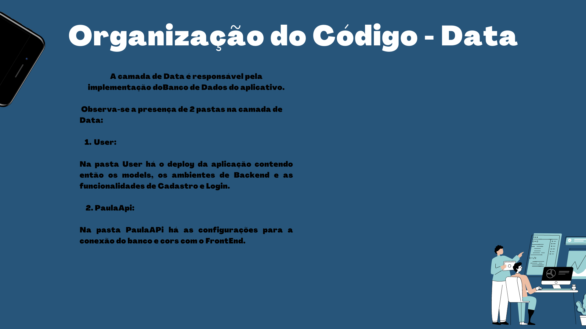

# Time de Requisitos 
 

## Kamban Framework SAFe

## Kamban PBB/BDD

#### PBB

#### BDD

## Kamban User Story Mapping

# Time de Métodos de Desenvolvimento de Software 
 

## Slide Modelo de Arquitetura

## Modelo de Classes de Produto

## [Link para o apk](https://drive.google.com/file/d/1Ca3aX9M5T_MvI0tYWR7n2OfCpfZ-7GbK/view?usp=sharing)

## Reporte das utilizações das práticas

Em relação a separação dos times de desenvolvimento, separamos em três duplas nos baseando na soft skills de cada um, revezando entre quem estava no comando do código(piloto) e o que estava revisando( co piloto). Essa prática nos ajudou a manter o código limpo, pois estava sendo sempre revisado pela dupla e pela equipe no geral em alguns momentos.