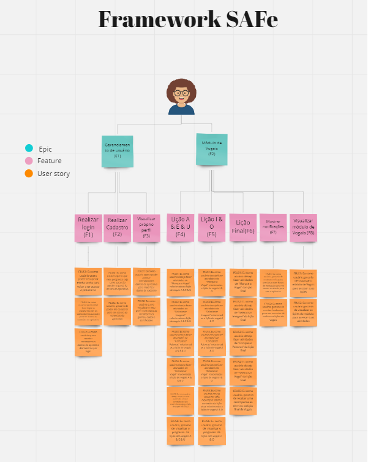
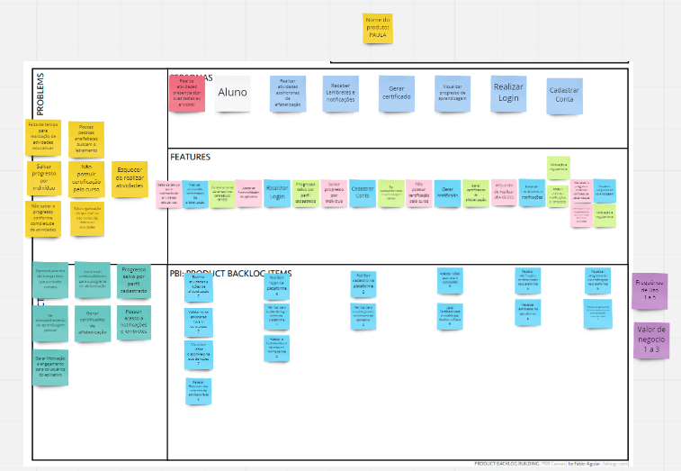
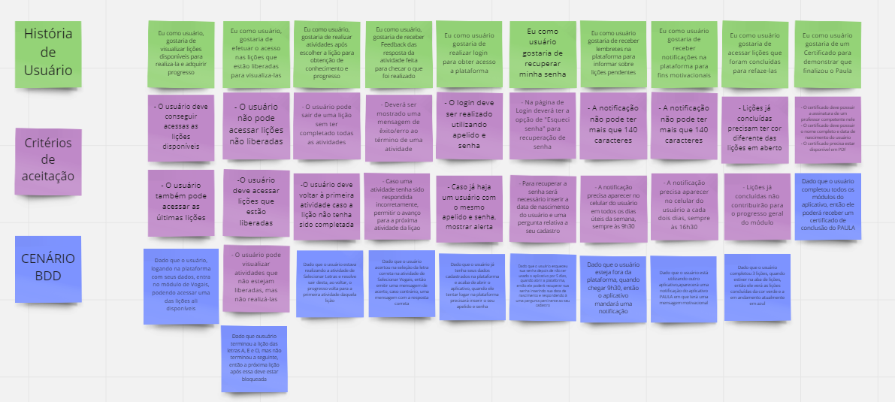
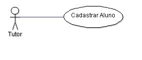
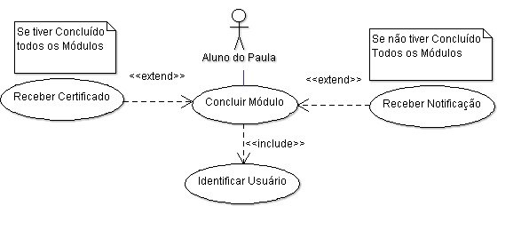

# Time de Requisitos

 

##Framework SAFe

##PBB/BDD

####PBB

####BDD

##User Story Mapping

##Casos de Uso

###Especificação de caso de uso "Cadastrar Aluno"

  
O aluno, com o auxílio de um Tutor (qual seja letrado). Cadastrará o Aluno no Sistema Paula. 

_Fluxo Básico_:  
1- O tutor acessa a opção cadastrar Aluno
2- O sistema apresenta os campos para serem preenchidos (RN2)
3- O tutor preenche os campos
4- O sistema válida os campos (FE1, FE2, FE3)
5- O sistema autêntica aluno
6- Encerra Caso de Uso  

_Regra de Negócios_:  
RN2. Campos de Cadastro são Nome, Apelido, Senha, Data de Aniversário e Gênero  

_Fluxo Erros_:  
FE1- Apelido Existente No passo . do fluxo básico, se o sistema determinar que o apelido do aluno já está sendo usado, o sistema mostra a mensagem "Aluno já Cadastrado"

FE2- Apelido Pequeno No passo . do fluxo básico, se o sistema determinar que o apelido deve possuir mais do que 3 caracteres, o sistema mostra a mensagem "O apelido deve possuir no mínimo 3 caracteres"

FE3- Senha No passo . do fluxo básico, se o sistema determinar que a senha não atingiu o tamanho mínimo de 4 caracteres, o sistema mostra a mensagem "A senha deve possuir mais do que 4 caracteres"

FE4- Data de Aniversário No passo . do fluxo básico, se o sistema determinar que o aluno cadastrado, tem menos de 5 anos de idade, o sistema mostra a mensagem "O aluno deve possuir mais do que 5 anos"

FE5- Campo não preenchido No passo . do fluxo básico, se o sistema determinar que algum campo não foi preenchido, o sistema mostra a mensagem "Informe <Campo Faltante>"

  
###Especificação de caso de uso Concluir Módulo
 

Para cada Lição do Módulo, o Usuário irá realizar atividades. Quando todas atividades tiverem prontas o Usuário conclui o Módulo 

_Fluxo Básico_:  
1- O aluno Efetua Login 
2- O sistema válida o apelido e senha (A1, A2) 
3- O aluno acessa um dos Módulo Disponíveis 
4- O sistema apresenta Lições Dentro do Módulo 
5- O aluno seleciona uma lição disponível 
6- O sistema exibe a lição 
7- O aluno realiza uma das 4 atividades da lição 
8- O sistema válida a resposta do Aluno (A3) 
9- O sistema atualiza o status da Atividade 
10- Se houver mais atividade de lição aluno retorna para 7. 
11- O sistema atualiza o status de progresso (A4) 
12- Se houver mais lições o aluno retorna para 5 
13- O sistema atualiza o status do Módulo como concluído. (RN1) 
14- Encerra o Caso de Uso  

_Regras de Negócio_:  
RN1. O Aluno recebe uma recompensa Virtual ao finalizar um Módulo.
  

_Fluxo Alternativos_:  
FA1. Aluno não cadastrado No passo 1 do fluxo básico, se o sistema determinar que o apelido do aluno não é válido, o sistema mostra a mensagem "Apelido Incorreto".

FA2. Senha Inválida No passo 1 do fluxo básico, se o sistema determinar que a senha do aluno não é válida, o sistema mostra a mensagem "Senha Incorreta".

FA3. Resposta Incorreta No passo 8 do fluxo básico, se o sistema determinar que o aluno não respondeu corretamente, o sistema deverá mostrar a mensagem "Reposta Errada", e prosseguir para próxima lição.

FA4. Lição Não Concluída No passo 11 do fluxo básico, se o sistema determinar que o aluno não respondeu corretamente mais de uma atividade, o sistema deverá definir o status da lição como não concluída e o aluno deverá realizar a lição novamente.

 
##[Link do Feedback do cliente sobre o produto](https://drive.google.com/drive/folders/10KJ_SKPHqVpJPsNYFnxn8oxrpm6G3PSC?usp=sharing)

 

# Time de Métodos de Desenvolvimento de Software

 

##[Link do Figma]
(https://www.figma.com/file/6A3gtyM7UHZpQ4wMvDWoqd/PAULA?node-id=0%3A1)

##[Link do Aplicativo APK]
(https://drive.google.com/file/d/1LQGWpBnBtHWd6iTJqcVuSoKgtY3l8AWk/view?usp=sharing)

##[Link do Video de Apresentação das Entregas]
(https://youtu.be/J9RXTFi0Un0)

## Plano de Testes

|Papel|Tipo|Nível|Técnica|
|:-------:|:---|:---|:---|
|Desenvolvedores|Funcional|Unitário|Caixa Preta e Caixa Branca - Manual|
|Professor|Funcional|Aceitação|Caixa Preta e Caixa Branca - Manual|
|Cliente|Usabilidade|Aceitação|Caixa Preta - Manual|

### Critérios Aceitação

#### Professor
- O usuario deve conseguir se cadastrar
- O usuario deve conseguir logar
- O usuário deve ser capaz de acessar os dados pessoais e as conquistas
- O usuário deve ser capaz de alterar a senha
- O usuário deve ser capaz de acessar o módulo de vogais
- O usuário deve ser capaz de acessar as lições do módulo
- Ao finalizar o módulo de vogais devera o receber uma conquista de conclusão de módulo.

#### Cliente
- O usuario deve conseguir se cadastrar
- O usuario deve conseguir logar
- O usuário deve ser capaz de acessar os dados pessoais e as conquistas
- O usuário deve ser capaz de alterar a senha
- O usuário deve ser capaz de acessar o módulo de vogais
- O usuário deve ser capaz de acessar as lições do módulo
- Ao finalizar o módulo de vogais devera o receber uma conquista de conclusão de módulo.