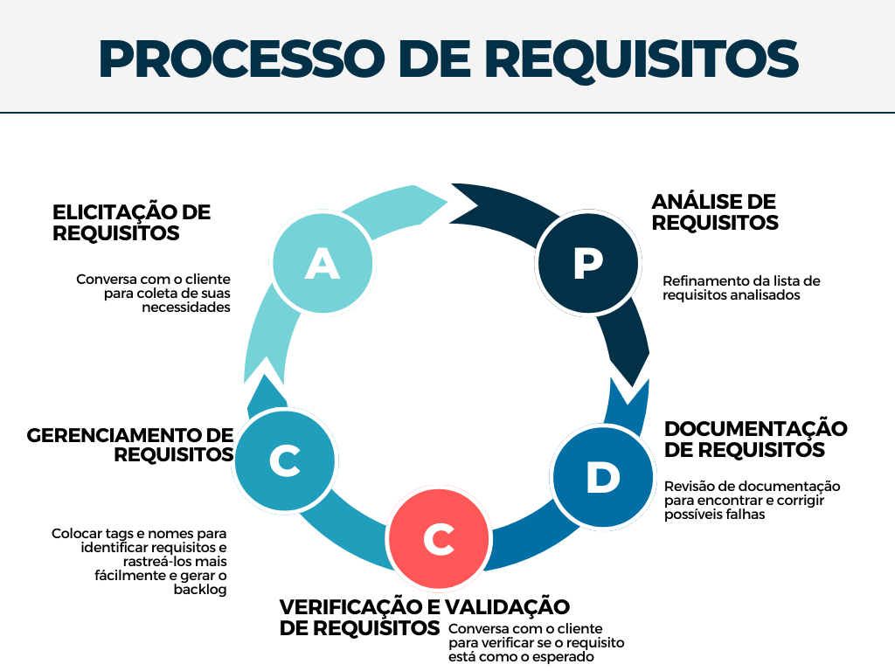
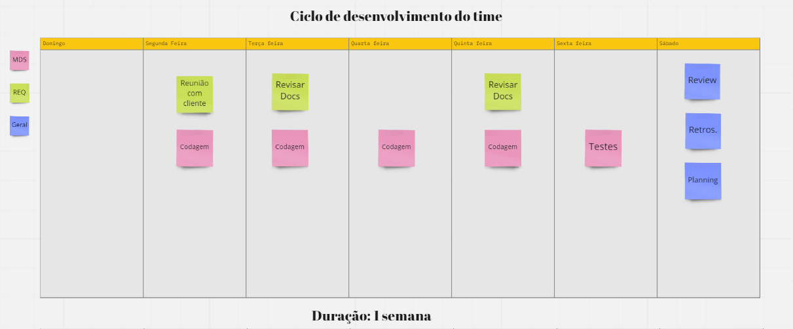

## 1 VISÃO GERAL DO PRODUTO

### 1.1 Declaração de Posição do Produto:

O PAULA (Paranoá Alfabetizando Utilizando Letramento Analógico) é um aplicativo mobile cujo escopo é contribuir na alfabetização de jovens e adultos com baixo grau de escolaridade, isto é, com nenhuma ou pouca instrução — público que não completou, abandonou ou não teve acesso à educação formal por qualquer motivo na região administrativa do Paranoá. Sendo assim, o PAULA destina-se às pessoas que desejam iniciar ou retomar seu processo de alfabetização.

Diferentemente de outros aplicativos semelhantes, tal como o AJA e Duolingo, o PAULA visa proporcionar dizeres regionais do Paranoá, recriando sua cultura e origem nas citações de palavras que o aplicativo repetirá ao ser utilizado.

|                 |                                                                                                                                             |
| --------------- | ------------------------------------------------------------------------------------------------------------------------------------------- |
| Para            | Jovens e adultos, da RA do Paranoá, com nenhuma ou pouca instrução.                                                                         |
| Dos quais(Quem) | Desejam retomar, ou começar sua alfabetização.                                                                                              |
| O PAULA         | É um aplicativo mobile educativo.                                                                                                           |
| Que             | Visa contribuir com a alfabetização inicial ou evolução da formação educacional básica com o usuário de forma lúdica e amigável ao usuário. |
| Ao contrário    | Plataforma AJA.                                                                                                                             |
| Nosso produto   | contará com dialetos e expressões populares da região, para maior familiaridade do usuário.                                                 |

### 1.2 Objetivos do Produto

A proposta desse projeto é desenvolver um aplicativo para aparelhos celulares, tipo smartphones com ferramentas visuais e auditivas, como o uso de uma dubladora para gravar falas para facilitar as informações, e didáticas para a alfabetização inicial dos usuários e terá como atrativo palavras e dizeres regionais do Paranoá para que a população se sinta orgulhosa de ter um software que recrie suas origens e cultura nas citações de palavras que o aplicativo repetirá ao ser utilizado.

### 1.3 Tecnologias a Serem Utilizadas

- Git: Controle de versionamento.
- GitHub: Repositório e definição de Sprints.
- GitHub Pages: Documentação do projeto
- Discord: Realização das reuniões.
- Telegram: Controle de contato com os integrantes do projeto.
- Flutter: Desenvolvimento do front-end.
- Python Django: Desenvolvimento do back-end.
- Trello: Organização do quadro Kanban — controle de sprints.

## 2 VISÃO GERAL DO PROJETO

### 2.1 Organização do Projeto

| Papel                      | Atribuições                                                                                                 | Responsável      | Participantes                                                                             |
| -------------------------- | ----------------------------------------------------------------------------------------------------------- | ---------------- | ----------------------------------------------------------------------------------------- |
| Desenvolvedores            | Codificar o produto, codificar testes unitários, realizar refatoração                                       | Emerson          | Emerson, Mateus Almeida, Caio Berg, Lucas de Padua, Thalis, Pedro Lucas, Fellipe Pereira  |
| Tech Lead                  | Será responsável pela qualidade do código e coordenará o uso e integração das tecnologias usadas no projeto | Emerson          | Emerson, Mateus Almeida, Caio Berg, Lucas de Padua, Thalis, Pedro Lucas, Fellipe Pereira. |
| Scrum Master               | Responsável por coordenar os rituais do Scrum de modo que sejam feitos corretamente                         | Cristian Furtado | Fellipe Pereira, Cristian Furtado, Rodrigo Santos, Valderson Junior, Victor Matheus.      |
| Product Owner              | Irá definir o escopo da sprint atual e fazer a verificação/validação dos requisitos com o cliente           | Fellipe Pereira  | Equipe de Requisitos                                                                      |
| Documentador de requisitos | Garantir a clareza dos requisitos e a realizar sua documentação, gerência e rastreabilidade.                | Rodrigo Santos   | Fellipe Pereira, Cristian Furtado, Rodrigo Santos, Valderson Junior, Victor Matheus.      |
| Cliente                    | Comunicar sobre as necessidades de seu projeto                                                              | Yoko, Emerson    | ---                                                                                       |

### 2.2 Planejamento das Fases e/ou Iterações do Projeto

O ciclo de vida de uma iteração (sprint) do time foi pensada para ter o prazo de uma semana cada sprint e esta começará na segunda-feira e se encerrará no sábado, onde haverá os ritos finais da sprint e o planejamento para a próxima.

### 2.3 Matriz de Comunicação

| Descrição                                                                  | Área/Envolvidos                                | Periodicidade  | Produtos Gerados                                           |
| -------------------------------------------------------------------------- | ---------------------------------------------- | -------------- | ---------------------------------------------------------- |
| Acompanhamento das Atividades em Andamento                                 | Equipe de Requisitos/Desenvolvimento           | Semanal/Diário | Dailies                                                  |
| Acompanhamento dos Riscos, Compromissos, Ações Pendentes, Indicadores      | Equipe de Requisitos                           | Quinzenal      | Resumo de reunião  |
| Comunicar situação do projeto                                              | Equipe Requisitos e Desenvolvimento e Cliente | Quinzenal      | Resumo de reunião |

### 2.4 Gerenciamento de Riscos

| Descrição                     | Causa                                                                                                                                                         | Medida Mitigadora                                                                                                                                                                                                                                                                                                                                          |
| ----------------------------- | ------------------------------------------------------------------------------------------------------------------------------------------------------------- | ---------------------------------------------------------------------------------------------------------------------------------------------------------------------------------------------------------------------------------------------------------------------------------------------------------------------------------------------------------- |
| Falta de conhecimento         | Tecnologia para captação de aúdio será deixada para ser implementada ao final do desenvolvimento.                                                             | Na pior das hipóteses, caso seja dada pela equipe a impossibilidade de implementação do requisito, será marcada uma reunião com o cliente para a exploração de vias alternativas.                                                                                                                                                                          |
| Diminuição da equipe          | Fatores externos, como trancamento de disciplina, ou internação hospitalar devido à pandemia ou outros fatores.                                               | Caso a equipe seja diminuída, será realizada uma reunião para a redefinição do backlog da sprint para a entrega do produto baseado na ordem de prioridade dos requisitos.                                                                                                                                                                                  |
| Diminuição do comprometimento | Os membros da equipe são universitários, então, é possível que compromissos externos afetem seus rendimentos — seja por estágio ou entrega de outras matérias | Dessa forma, de modo a mitigar tal fato, será questionado aos membros a cada reunião diária (daily) se eles conseguirão entregar a dada tarefa. Caso haja impedimentos, tal fato será tratado da mesma forma que a diminuição da equipe, isto é, redefinição do backlog da sprint para a entrega do produto baseado na ordem de prioridade dos requisitos. |

### 2.5 Critérios de Replanejamento

| Descrição                                                        | Causa                                                 | Replanejamento                                                                                                                                                                                     |
| ---------------------------------------------------------------- | ----------------------------------------------------- | -------------------------------------------------------------------------------------------------------------------------------------------------------------------------------------------------- |
| Equipe com dificuldade de entregar e desenvolver funcionalidades | Comprometimento com outras matérias/ Motivos pessoais | Aliviar nas funcionalidades do ciclo de desenvolvimento atual/próximo ciclo                                                                                                                        |
| Falta da funcionalidade da captação de áudio do usuário          | Recurso e tempo                                       | Descartar essa funcionalidade, a fim de entregar um produto com qualidade, mediante a essa problemática.                                                                                           |
| Equipe com déficit de participantes                              | Trancamento/Desistiu da matéria                       | Tentar manter o desenvolvimento das funcionalidades, mesmo com a equipe com esse déficit. No último caso, colocar um integrante de uma equipe em outra para equilibrar Requisitos/Desenvolvimento. |

## 3 PROCESSO DE DESENVOLVIMENTO DE SOFTWARE

O processo de desenvolvimento de software será feito por uma abordagem ágil, onde a equipe de desenvolvimento terá fixo o tempo e os recursos, no caso o período letivo do semestre, com os requisitos variáveis, priorizados pelo cliente.

- Ciclo de vida evolutivo
- Scrum/Kanban
- Análise dos requisitos
- Analise e design:

  |Atividade | Objetivo | Papel | Método | Ferramenta |
  |----------|----------|-------|--------|------------|
  |Definir design das interfaces | Criar um modelo das interfaces que serão desenvolvidas | Product Owner e Equipe de Desenvolvimento | "UCD, Design Iterativo" | Figma
  | Definir do banco de dados | Criar um modelo do banco de dados que serão desenvolvidas | Equipe de Desenvolvimento | Modelo Relacional | Miro
  |Revisão de interface | Validar a interface para o desenvolvimento | Equipe de Desenvolvimento | Reunião com o Product Owner e cliente |"Figma, Miro"

- Implementação:

  |Atividade | Objetivo | Papel | Método | Ferramenta |
  |----------|----------|-------|--------|------------|
  |Codificação das Interfaces | Desenvolver as telas definidas pela sprint | Equipe de Desenvolvimento | Seguir o design definido anteriormente | Flutter
  |Codificação do banco de dados | Desenvolver o banco de dados definido pela sprint | Equipe de Desenvolvimento | Seguir o design definido anteriormente| MySQL

- Testes:

  |Atividade | Objetivo | Papel | Método | Ferramenta |
  |----------|----------|-------|--------|------------|
  |Realizar Teste| Encontrar falhas no software| Equipe de Desenvolvimento| Testes manuais| xxx
  |Realizar Teste Unitarios| Encontrar falhas no software| Equipe de Desenvolvimento| Testes de widget| "Pacote ""test"""

## 4 PROCESSO DE ENGENHARIA DE REQUISITOS

O processo da engenharia de requisitos será feito por uma abordagem ágil, onde a equipe de desenvolvimento irá trabalhar com as metodologias Scrum/Kanban, um híbrido que pode auxiliar no desenvolvimento do nosso projeto.
A figura abaixo explica o processo que a equipe de requisitos se baseará para a montagem dos artefatos da disciplina e suas etapas.

### 4.1 Elicitação de Requisitos

| Atividade                                               | Método               | Ferramenta   | Entrega                          |
| ------------------------------------------------------- | -------------------- | ------------ | -------------------------------- |
| Pesquisa sobre o tema do projeto e seu campo de atuação | Pesquisa             | Google       | Conhecimento sobre o produto     |
| Conversa com o cliente para coleta de suas necessidades                               | Entrevista e reunião | Google meets | Lista de requisitos preliminares |

### 4.2 Análise de Requisitos

| Atividade                                                                             | Método  | Ferramenta           | Entrega                                                  |
| ------------------------------------------------------------------------------------- | ------- | -------------------- | -------------------------------------------------------- |
| Conversa com o cliente e com a equipe de desenvolvimento para verificar a viabilidade | Reunião | Discord/Google Meets | Lista de requisitos analisados que irão compor o Backlog |
| Refinamento da lista de requisitos analisados | Reunião | Discord/Meets | Lista de requisitos com níveis de abstração próprios |
| Definição do MVP/Épico com base nos requisitos refinados | Framework SAFe | Discord, Miro | MVP/Épico definido com suas features e histórias|
| Definir critérios de aceitação | Entrevistas, reuniões em equipe | Discord | Histórias de usuários com critérios de aceitação |

### 4.3 Documentação de Requisitos

| Atividade                                                             | Método                  | Ferramenta                | Entrega                                                                                         |
| --------------------------------------------------------------------- | ----------------------- | ------------------------- | ----------------------------------------------------------------------------------------------- |
| Tradução de requisitos em formato mais compreensível aos stakeholders | Linguagem natural       | Requisitos bem descritos  |
| Listagem de requisitos encontrados da fase de análise                 | Definição em categorias | GitHub Pages, Google Docs | Lista de requisitos documentados e seus tipos (não funcional e funcional), o Backlog do projeto |
| Revisão de documentação para encontrar e corrigir possíveis falhas | Reunião | GitHub Pages | Documentação revisada |

### 4.4 Verificação e Validação de Requisitos

| Atividade                                                                 | Método                                    | Ferramenta           | Entrega                           |
| ------------------------------------------------------------------------- | ----------------------------------------- | -------------------- | --------------------------------- |
| Verificação da qualidade do código                                        | Inspeção, Walkthrough, Check-lists        | Discord              | Atualização do Backlog do produto |
| Conversa com o cliente para verificar se o requisito está como o esperado | Reunião com toda a equipe e com o cliente | Discord/Google Meets | Atualização do Backlog do produto |

### 4.5 Gerenciamento de Requisitos

| Atividade                                                                      | Método                                            | Ferramenta                | Entrega                                                           |
| ------------------------------------------------------------------------------ | ------------------------------------------------- | ------------------------- | ----------------------------------------------------------------- |
| Colocar tags e nomes para identificar requisitos e rastreá-los mais fácilmente | Etiquetação de cada requisito por números e nomes | Trello, Discord, Telegram | Requisitos nomeados e priorizados, facilitados para gerenciamento |

  As atividades listadas anteriormente tanto do processo da ER quanto do desenvolvimento do produto estão compreendidas dentro da sprint desta forma:

   
 

## 5 BACKLOG DO PRODUTO

| TEMA | EPICO | FEATURE | US |
| :---  | :---  | :--- | :--- |
| **PAULA** | **(E1) Gerenciamento de usuário** | (F1) Realizar Login | (F1US1) *Eu como usuário quero poder recuperar minha senha para voltar a ter acesso à plataforma* |
| | | | (F1US2) *Eu como usuário quero poder fazer login na plataforma com os dados do meu cadastro para ter acesso ao conteúdo do aplicativo* |
| | | | (F1US3) *Eu como usuário quero receber recompensas dentro do aplicativo diariamente por login* |
| | | (F2) Realizar Cadastro | (F2US1) *Eu como usuário quero que meu progresso seja salvo para não perder o que já fiz dentro do aplicativo* 
| | | | (F2US2) *Eu como usuário, gostaria de poder me cadastrar para ter acesso ao conteúdo do aplicativo*|
| | | (F3) Visualizar próprio perfil | (F3US1) *Eu como usuário quero poder acessar configurações dentro do aplicativo para modificar dados de cadastro*|
| | | | (F3US2) *Eu como usuário quero visualizar o meu perfil com todos as recompensas ganhas, dados e certificados*|
| | **(E2) Módulo de Vogais** | (F4) Lição A & E & U |(F4US1) *Eu como usuário desejo fazer atividades de "Marque a Vogal" relacionadas a lição de vogais A & E & U* |
| | | | (F4US2) *Eu como usuário desejo fazer atividades de "Selecionar Imagem" relacionadas a lição de vogais A & E & U*|
| | | | (F4US3) *Eu como usuário desejo fazer atividades de "Completar Palavras" relacionadas a lição de vogais A & E & U*|
| | | | (F4US4) *Eu como usuário desejo fazer atividades de "Selecionar Vogal" relacionadas a lição de vogais A & E & U*|
| | | | (F4US5) *Eu como usuário desejo visualizar uma explicação sobre o conteúdo da lição atual relacionadas a lição de vogais A & E & U*|
| | | | (F4US6) *Eu como usuário, gostaria de  visualizar o progresso  da lição das vogais A & E & U*|
| | | (F5) Lição I & O | (54US1) *Eu como usuário desejo fazer atividades de "Marque a Vogal" relacionadas a lição de vogais I & O* |
| | | | (F5US2) *Eu como usuário desejo fazer atividades de "Selecionar Imagem" relacionadas a lição de vogais I & O*|
| | | | (F5US3) *Eu como usuário desejo fazer atividades de "Completar Palavras" relacionadas a lição de vogais I & O*|
| | | | (F5US4) *Eu como usuário desejo fazer atividades de "Selecionar Vogal" relacionadas a lição de vogais I & O*|
| | | | (F5US5) *Eu como usuário desejo visualizar uma explicação sobre o conteúdo da lição atual relacionadas a lição de vogais I & O*|
| | | | (F5US6) *Eu como usuário, gostaria de  visualizar o progresso  da lição das vogais I & O*|
| | | | (F7US2) *Eu como usuário quero receber recompensas dentro do aplicativo após a execução de alguma atividade*|
| | | | (F7US3) *Eu como usuário quero, após a conclusão de todas as atividades, receber um certificado para comprovar minha aprendizagem*|
| | | (F6) Lição Final | (F6US1) *Eu como usuário desejo fazer atividades de "Marque a Vogal" da lição final* |
| | | | (F6US2) *Eu como usuário desejo fazer atividades de "Selecionar Imagem" da lição final* |
| | | | (F6US3) *Eu como usuário desejo fazer atividades de "Completar Palavras" da lição final* |
| | | | (F6US4) *Eu como usuário desejo fazer atividades de "Selecionar Vogal" da lição final* |
| | | | (F6US5) *Eu como usuário, gostaria de receber uma recompensa ao término da lição final de Vogais* |
| | | (F7) Mostrar Notificações | (F7US1) *Eu como usuário, gostaria de receber notificações periódicas com frases de motivação para me manter motivado para usar o aplicativo* |
| | | | (F7US2) *Eu como usuário, gostaria de receber lembretes para me recordar de realizar as lições de Vogais* |
| | | (F8) Visualizar módulo de Vogais | (F8US1) *Eu como usuário gostaria de visualizar o módulo de Vogais para acessar suas lições* |
| | | | (F8US2) *Eu como usuário gostaria de visualizar as lições do módulo  para acessar suas atividades* |

## 6 REFERÊNCIAS BIBLIOGRÁFICAS

> [1]. Sommerville, Software Engineering, 2004   [2]. P. Bourque, SWEBOK Guide Call for Reviewers, May 2003.    [3]. Ambler, S., Agile Modeling, Wiley, 2002.  

## 7 Histórico de Revisão

| Data       | Versão	| Descrição | Autor |
| ---------- | ------ | --------- | -----
| 25/06/2022 | 1.0    | Inicia preenchimento do documento | Cristian Furtado, Valderson Junior, Rodrigo Santos, Fellipe Pereira |
| 27/06/2022 | 1.1    | Preenche campos de Visão Geral do Projeto e Produto e indica dúvidas para serem solucionadas |Cristian Furtado, Valderson Junior, Rodrigo Santos, Fellipe Pereira |
| 28/06/2022 | 1.1.1  | Preenche campos indicados com dúvida | Cristian Furtado, Fellipe Pereira |
| 29/06/2022 | 1.2    | Adicionado documento à Github Pages | Rodrigo Santos
| 29/06/2022 | 1.3    | Revisão do Documento de Visão Geral do Produto e Projeto | Cristian Furtado, Fellipe Pereira, Rodrigo Santos, Valderson Junior
| 13/07/2022 | 1.4 | Revisão do documento | Cristian Furtado
| 20/07/2022 | 1.5 | Revisão do documento | Cristian Furtado, Fellipe Pereira, Rodrigo Santos, Valderson Junior
| 26/07/2022 | 1.6 | Revisão do documento | Cristian Furtado, Valderson Junior
| 03/08/2022 | 1.7 | Preenche campos de lições aprendidas e reformula ciclo de desenvolvimento e de ER | Cristian Furtado
| 03/08/2022 | 1.8 | Reformula as sprints e a matriz de comunicação | Cristian Furtado
| 11/08/2022 | 1.9 | Refatora o visão retirando as definições das sprints | Cristian Furtado
| 13/08/2022 | 2.0 | Adiciona o Product Backlog ao docunmento de visão | Cristian Furtado
| 15/08/2022 | 2.1 | Retira (F1) e (F2) e suas respectivas US's e retira (F8US3) | Cristian, Valderson
| 05/09/2022 | 2.1 | Refatora o Product Backlog praticamente todo: adiciona dois novos épicos (E1) e (E2), realoca US e FE que já existiam para dentro destes épicos e retira (F9US3) devido a imposssibilidade de completá-lo  | Cristian Furtado
| 06/09/2022 | 2.2 | Adiciona imagem do ciclo da engenharia de requisitos  | Cristian Furtado
| 07/09/2022 | 2.3 | Melhora descrição da imagem do ciclo da engenharia de requisitos  | Cristian Furtado